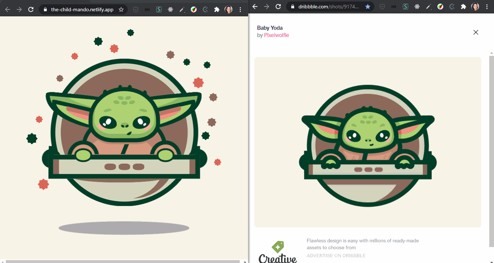

<h1 align="center">The Child - HTML & CSS Puro</h1>

<blockquote align="center">“A chave para transformação é a continuidade. Continue a codar!!!”</blockquote>

 

Deploy <a href="https://the-child-mando.netlify.app/" target="_blank">aqui!</a>

 

 
 

## Sumário

- [Apresentação da Ilustração HTML e CSS](#-apresentação-da-ilustração-html-e-css)
- [Sobre a Ilustração](#-sobre-a-ilustração)
- [Tecnologias utilizadas](#-tecnologias-utilizadas)

 

## Apresentação da Ilustração HTML e CSS

 

  

 

## Sobre a Ilustração

 

Desde criança que gosto de desenhar, e ó, até que desenho bem, rs. <a href="https://www.instagram.com/morenagnobre/?hl=pt-br" target="_blank"> Dá uma olhadinha aqui! </a> E passeando pelo Youtube comecei a ver vários vídeos com ilustrações feitas puramente em HTML e CSS, e eu adoro o frontend, com isso vi duas coisas fantásticas em uma só!!! Tive que fazer! Fiz vários tutoriais para aprender e finalmente consegui fazer por conta essa ilustração do The Child.

A ilustração em si não é minha, eu a encontrei no Dribbble de um(a) talentosíssimo(a) artista com o nickname de <a href="https://dribbble.com/shots/9174418-Baby-Yoda" target="_blank"> Pixelwolfie </a>. E me baseando na ilustração dele(a) desenvolvi esse projetinho

Abaixo segue a ilustração em HTML e CSS do lado esquerdo e a ilustração de Pixelwolfie à direita.

 

  

 

Você pode encontrar o processo da ilustração HTML e CSS <a href="#" target="_blank">aqui! </a> Divirta-se!

 

## Tecnologias Utilizadas

 

<code></code>
<code></code>

 
 

 
 

<h3 align="center">
    
</h3>
